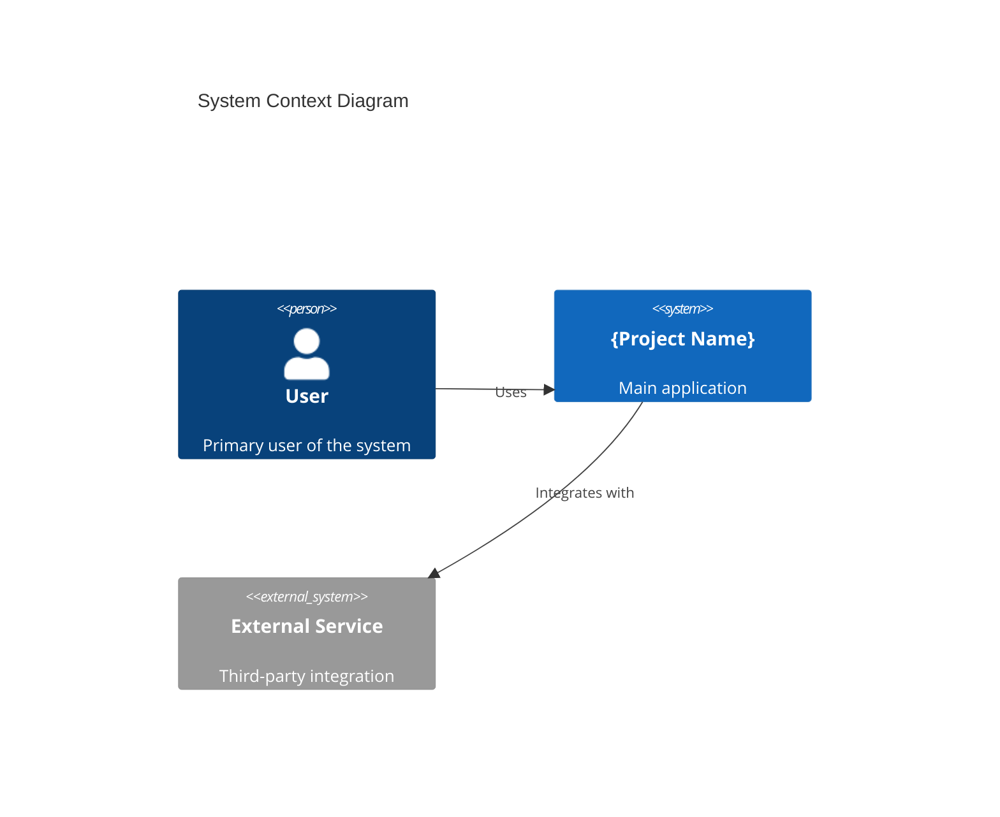
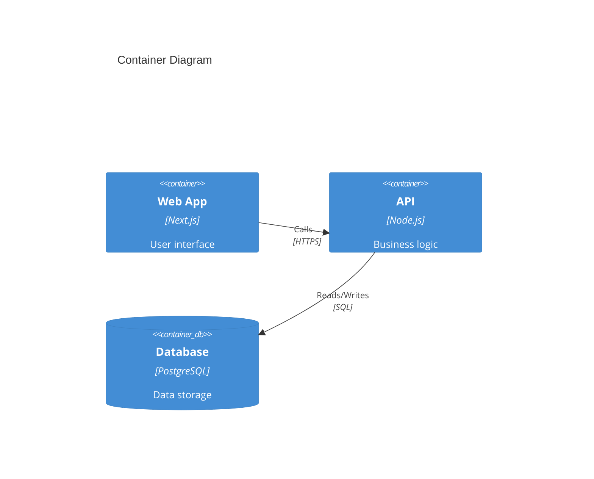
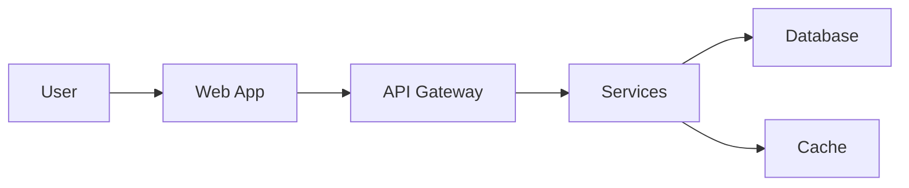
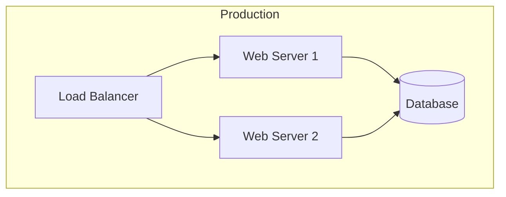
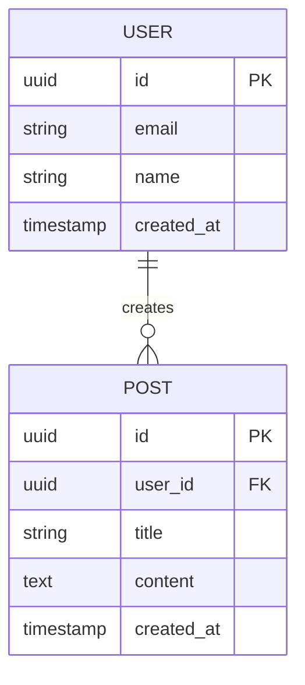

# Documentation: Architecture Phase

## Overview

Generate architecture documents that define system structure, APIs, data models, and key decisions.

**Announce at start:** "I'm using the docs-architecture skill to generate architecture documents."

## Documents Generated

| Document | Purpose |
|----------|---------|
| `SYSTEM_OVERVIEW.md` | High-level architecture with diagrams |
| `API_DESIGN.md` | API structure, endpoints, contracts |
| `DATA_MODEL.md` | Database schema, entities, relationships |
| `SECURITY.md` | Security architecture and measures |
| `adr/ADR-NNN_*.md` | Architecture Decision Records |

## Input Required

From previous phases and codebase:
- Tech stack (from TECH_RADAR)
- Features (from MVP_DEFINITION)
- Existing code patterns (from due diligence)
- Security requirements
- Integration needs

## SYSTEM_OVERVIEW.md Template

```markdown
# System Overview: {Project Name}

## Architecture Summary
{2-3 sentence description of overall architecture approach}

## System Context



## Container Diagram



## Component Overview

| Component | Technology | Purpose |
|-----------|------------|---------|
| Frontend | {Tech} | {Purpose} |
| Backend | {Tech} | {Purpose} |
| Database | {Tech} | {Purpose} |
| Cache | {Tech} | {Purpose} |

## Key Design Decisions

| Decision | Choice | Rationale |
|----------|--------|-----------|
| {Area} | {What chosen} | {Why} |

See `adr/` for detailed Architecture Decision Records.

## Data Flow



## Deployment Architecture



## Technology Stack

| Layer | Technology | Version |
|-------|------------|---------|
| Frontend | {Tech} | {Version} |
| Backend | {Tech} | {Version} |
| Database | {Tech} | {Version} |
| Infrastructure | {Tech} | {Version} |

---
_Created: {YYYY-MM-DD}_
```

## API_DESIGN.md Template

```markdown
# API Design: {Project Name}

## Overview
{Brief description of API architecture approach}

## Base URL
- Development: `http://localhost:3000/api`
- Staging: `https://staging.example.com/api`
- Production: `https://api.example.com`

## Authentication
{Auth mechanism - JWT, OAuth, API Key, etc.}

## Common Headers

| Header | Required | Description |
|--------|----------|-------------|
| `Authorization` | Yes | Bearer token |
| `Content-Type` | Yes | application/json |

## Endpoints

### {Resource 1}

#### List
```
GET /api/{resource}
```

**Query Parameters:**
| Param | Type | Description |
|-------|------|-------------|
| `page` | number | Page number |
| `limit` | number | Items per page |

**Response:**
```json
{
  "data": [...],
  "pagination": {
    "page": 1,
    "limit": 20,
    "total": 100
  }
}
```

#### Get One
```
GET /api/{resource}/:id
```

#### Create
```
POST /api/{resource}
```

**Request Body:**
```json
{
  "field1": "value",
  "field2": "value"
}
```

#### Update
```
PATCH /api/{resource}/:id
```

#### Delete
```
DELETE /api/{resource}/:id
```

## Error Handling

```json
{
  "error": {
    "code": "ERROR_CODE",
    "message": "Human readable message",
    "details": {}
  }
}
```

| Status Code | Meaning |
|-------------|---------|
| 400 | Bad Request |
| 401 | Unauthorized |
| 403 | Forbidden |
| 404 | Not Found |
| 500 | Server Error |

---
_Created: {YYYY-MM-DD}_
```

## DATA_MODEL.md Template

```markdown
# Data Model: {Project Name}

## Overview
{Brief description of data architecture}

## Entity Relationship Diagram



## Entities

### User
| Column | Type | Constraints | Description |
|--------|------|-------------|-------------|
| id | UUID | PK | Unique identifier |
| email | VARCHAR(255) | UNIQUE, NOT NULL | User email |
| name | VARCHAR(255) | NOT NULL | Display name |
| created_at | TIMESTAMP | NOT NULL | Creation time |

### {Entity 2}
| Column | Type | Constraints | Description |
|--------|------|-------------|-------------|
| ... | ... | ... | ... |

## Indexes

| Table | Index | Columns | Type |
|-------|-------|---------|------|
| users | users_email_idx | email | UNIQUE |

## Migrations Strategy
{How database migrations are handled}

---
_Created: {YYYY-MM-DD}_
```

## SECURITY.md Template

```markdown
# Security Architecture: {Project Name}

## Overview
{Security approach and principles}

## Authentication

### Method
{JWT/OAuth/Session - how users authenticate}

### Token Management
- Access token expiry: {duration}
- Refresh token expiry: {duration}
- Storage: {where tokens stored}

## Authorization

### Role-Based Access Control

| Role | Permissions |
|------|-------------|
| Admin | Full access |
| User | Own resources |
| Guest | Read public |

## Data Protection

### Encryption
- At rest: {method}
- In transit: {method}

### Sensitive Data
| Data Type | Protection |
|-----------|------------|
| Passwords | bcrypt hash |
| PII | Encrypted |
| Tokens | Secure storage |

## Security Headers

| Header | Value | Purpose |
|--------|-------|---------|
| Content-Security-Policy | {policy} | XSS prevention |
| X-Frame-Options | DENY | Clickjacking |
| Strict-Transport-Security | max-age=31536000 | HTTPS |

## Vulnerability Management

- Dependency scanning: {tool}
- Security testing: {approach}
- Incident response: {process}

---
_Created: {YYYY-MM-DD}_
```

## ADR Template

```markdown
# ADR-{NNN}: {Title}

## Status
{Proposed | Accepted | Deprecated | Superseded}

## Context
{What is the issue we're addressing?}

## Decision
{What did we decide to do?}

## Consequences

### Positive
- {Benefit 1}
- {Benefit 2}

### Negative
- {Tradeoff 1}
- {Tradeoff 2}

### Neutral
- {Observation 1}

## Alternatives Considered

### {Alternative 1}
{Why not chosen}

### {Alternative 2}
{Why not chosen}

---
_Date: {YYYY-MM-DD}_
_Author: {Name}_
```

## Output Location

Save documents to:
- Standard: `docs/architecture/`, `docs/architecture/adr/`
- Monorepo root: `docs/architecture/` (system-wide)
- Monorepo app: `apps/{app}/docs/architecture/`

## Remember

- Use mermaid diagrams for visualizations
- Create ADRs for significant decisions
- Reference actual tech stack from TECH_RADAR
- Keep diagrams up to date with implementation
