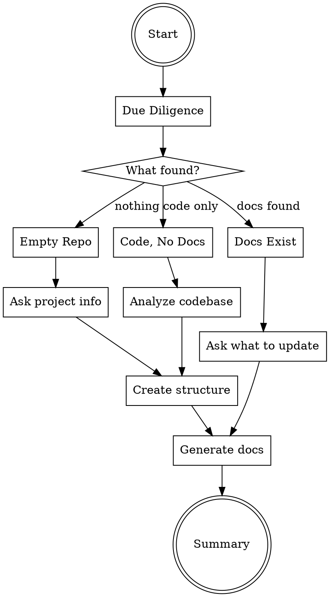

# Documentation Bootstrap

## Overview

Bootstrap project documentation structure with lifecycle phases and planning hierarchy. Performs due diligence first, then creates appropriate documentation based on repo state.

**Announce at start:** "I'm using the docs-bootstrap skill to set up project documentation."

## The Process



## Phase 1: Due Diligence

Analyze the repository to understand current state:

### 1.1 Check for existing docs

```bash
# Check if docs/ exists
ls -la docs/ 2>/dev/null

# Check for monorepo indicators
ls -la apps/ packages/ 2>/dev/null
cat pnpm-workspace.yaml turbo.json nx.json 2>/dev/null
```

### 1.2 Detect project type

| Indicator | Type |
|-----------|------|
| `apps/` or `packages/` directory | Monorepo |
| `pnpm-workspace.yaml` | pnpm monorepo |
| `turbo.json` | Turborepo |
| `nx.json` | Nx monorepo |
| None of above | Standard project |

### 1.3 Analyze codebase (if code exists)

- Read `package.json`, `README.md`, existing docs
- Identify tech stack, frameworks, languages
- Extract project name, description, goals
- Note existing patterns and conventions

## Phase 2: Determine Action

### Empty Repo → New Setup

Ask for project information:
- Project name
- Short description
- Primary goals (3-5 bullet points)
- Target users/audience

**No confirmation needed** → Proceed to create all phases.

### Code Exists, No Docs → Generate from Analysis

Show analysis summary:
- Tech stack detected
- Project structure
- Patterns identified

**No confirmation needed** → Proceed to create all phases.

### Docs Exist → Update Mode

Show current state:
- What documentation exists
- What's missing from standard structure

**Confirm with user** → Ask which phases to update/regenerate.

## Phase 3: Create Structure

### Standard Project

```bash
mkdir -p docs/{inception,vision,architecture,design,planning/epics}
```

Creates:
```
docs/
├── inception/
├── vision/
├── architecture/
│   └── adr/
├── design/
└── planning/
    └── epics/
```

### Monorepo

```bash
# Root docs (big picture, diagrams)
mkdir -p docs/{architecture,diagrams,adr}

# Per-app docs
for app in apps/*; do
  mkdir -p "$app/docs/{inception,vision,architecture,design,planning/epics}"
done
```

Creates:
```
docs/                          # Root: system-wide
├── SYSTEM_ARCHITECTURE.md
├── diagrams/
└── adr/

apps/
├── web/docs/                  # Per-app: full structure
└── api/docs/
```

## Phase 4: Generate Documents

Invoke specialized skills for each phase:

### For New Setup (all phases)

1. **REQUIRED SUB-SKILL:** Use `orbty-eazy:docs-inception`
2. **REQUIRED SUB-SKILL:** Use `orbty-eazy:docs-vision`
3. **REQUIRED SUB-SKILL:** Use `orbty-eazy:docs-architecture`
4. **REQUIRED SUB-SKILL:** Use `orbty-eazy:docs-design`
5. **REQUIRED SUB-SKILL:** Use `orbty-eazy:project-planning`

### For Update Mode

Only invoke skills for phases user selected to update.

## Phase 5: Summary

After document generation:

```markdown
## Documentation Bootstrap Complete

### Created Structure
- docs/inception/ (4 documents)
- docs/vision/ (4 documents)
- docs/architecture/ (5 documents)
- docs/design/ (2 documents)
- docs/planning/ (ROADMAP, USER_STORIES, 1 epic, 3 tasks)

### Next Steps
1. Review generated documents and refine as needed
2. Use `orbty-eazy:task-planning` to add more tasks
3. Use `orbty-eazy:writing-plans` to enrich a TASK for implementation
4. Use `orbty-eazy:executing-plans` to implement enriched TASKs

### Commands Available
- `/docs-inception` - Update inception docs
- `/docs-vision` - Update vision docs
- `/docs-architecture` - Update architecture docs
- `/docs-design` - Update design docs
- `/project-planning` - Update planning hierarchy
```

## Monorepo Handling

When monorepo detected:

1. Ask which app(s) to bootstrap: "Found apps: web, api, admin. Bootstrap docs for which?"
2. Create root `docs/` for system-wide documentation
3. Create `apps/{selected}/docs/` for each selected app
4. Run document generation for each selected app

Root `docs/` contains:
- `SYSTEM_ARCHITECTURE.md` - Cross-app architecture (mermaid diagrams)
- `diagrams/` - System-wide diagrams
- `adr/` - Cross-cutting architectural decisions

## Quick Reference

| Repo State | Confirmation | Action |
|------------|--------------|--------|
| Empty | No | Ask project info → Create all |
| Code, no docs | No | Analyze → Create all |
| Docs exist | Yes | Ask what to update → Update selected |

## Common Mistakes

| Mistake | Fix |
|---------|-----|
| Creating docs without due diligence | Always analyze first |
| Skipping monorepo detection | Check for apps/, packages/, workspace configs |
| Not asking for project info on empty repo | Can't generate meaningful docs without context |
| Overwriting existing docs without confirmation | Always confirm in update mode |
