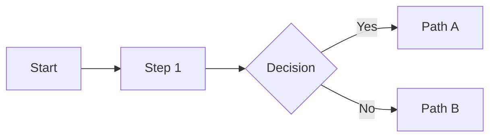

# Frontend Design

## Overview

This skill operates in **two modes**:

| Mode | Trigger | Purpose |
|------|---------|---------|
| **Docs Mode** | `bootstrap` skill invokes after `architecture` | Generate Full Suite design documents |
| **Implementation Mode** | `executing-plans` detects `specialist: frontend-design` | Execute UI-related tasks |

**Announce at start:** "I'm using the frontend-design skill to [generate design documentation / implement UI]."

---

# DOCS MODE

## Trigger

Invoked by `bootstrap` skill after `architecture` completes.

## Input Gathering

### From Existing Docs (read automatically)

| Source | Extract |
|--------|---------|
| `docs/inception/PROJECT_CHARTER.md` | Project scope, objectives, constraints |
| `docs/inception/STAKEHOLDER_MAP.md` | Target audience, decision makers |
| `docs/vision/PRODUCT_VISION.md` | Product vision, goals |
| `docs/vision/TARGET_PERSONAS.md` | User profiles, needs, behaviors |
| `docs/vision/VALUE_PROPOSITION.md` | Unique selling points, differentiation |

### From User (minimal questions)

Ask only these three questions:

1. **"Share reference websites or screenshots you want to draw inspiration from"**
   - Accept URLs or paths to screenshots
   - Drop images in `docs/design/references/`

2. **"Any brand assets that already exist?"**
   - Logos, colors, fonts, brand guidelines
   - Link to existing assets or describe

3. **"Target platforms?"**
   - Web, Mobile, Desktop, All
   - Responsive requirements

## Autonomous Research

After gathering inputs:

1. **WebSearch** for current design trends in the project's domain
2. **WebFetch** reference URLs provided by user
3. **Read** screenshots from `docs/design/references/`
4. Analyze and synthesize into opinionated design decisions

**Key principle:** Make autonomous, opinionated decisions based on research and trends. Don't ask endless questions.

## Output: Full Suite Documents

Create folder structure:

```bash
mkdir -p docs/design/references
touch docs/design/references/.gitkeep
```

Generate seven documents:

```
docs/design/
├── STYLE_GUIDE.md
├── UI_DESIGN_SYSTEM.md
├── UX_PRINCIPLES.md
├── REFERENCES.md
├── COMPONENT_SPEC.md
├── ANIMATION_GUIDE.md
├── RESPONSIVE_STRATEGY.md
└── references/
    └── .gitkeep
```

### STYLE_GUIDE.md Template

```markdown
# Style Guide: {Project Name}

## Brand Identity

### Color Palette

#### Primary Colors
| Name | Hex | RGB | Usage |
|------|-----|-----|-------|
| {name} | #{hex} | rgb(r,g,b) | {when to use} |

#### Secondary Colors
| Name | Hex | RGB | Usage |
|------|-----|-----|-------|
| {name} | #{hex} | rgb(r,g,b) | {when to use} |

#### Semantic Colors
| Name | Hex | Usage |
|------|-----|-------|
| Success | #{hex} | Positive actions, confirmations |
| Warning | #{hex} | Caution states |
| Error | #{hex} | Errors, destructive actions |
| Info | #{hex} | Informational messages |

### CSS Variables

```css
:root {
  /* Primary */
  --color-primary: #{hex};
  --color-primary-hover: #{hex};
  --color-primary-active: #{hex};

  /* Secondary */
  --color-secondary: #{hex};

  /* Neutrals */
  --color-background: #{hex};
  --color-surface: #{hex};
  --color-text: #{hex};
  --color-text-muted: #{hex};

  /* Semantic */
  --color-success: #{hex};
  --color-warning: #{hex};
  --color-error: #{hex};
  --color-info: #{hex};
}
```

## Typography

### Font Families

| Role | Font | Weight | Fallback |
|------|------|--------|----------|
| Display | {Font Name} | 700 | {fallback stack} |
| Heading | {Font Name} | 600 | {fallback stack} |
| Body | {Font Name} | 400-500 | {fallback stack} |
| Mono | {Font Name} | 400 | {fallback stack} |

### Font Import

```css
@import url('https://fonts.googleapis.com/css2?family={Font}:wght@400;500;600;700&display=swap');
```

### Type Scale

| Level | Size | Weight | Line Height | Usage |
|-------|------|--------|-------------|-------|
| Display | 3rem | 700 | 1.1 | Hero headlines |
| H1 | 2.25rem | 600 | 1.2 | Page titles |
| H2 | 1.5rem | 600 | 1.3 | Section headers |
| H3 | 1.25rem | 500 | 1.4 | Subsections |
| Body | 1rem | 400 | 1.5 | Paragraph text |
| Small | 0.875rem | 400 | 1.4 | Captions, labels |

## Spacing

### Scale

| Token | Value | Usage |
|-------|-------|-------|
| space-xs | 0.25rem | Tight gaps |
| space-sm | 0.5rem | Component padding |
| space-md | 1rem | Default spacing |
| space-lg | 1.5rem | Section gaps |
| space-xl | 2rem | Major sections |
| space-2xl | 3rem | Page-level |

### CSS Variables

```css
:root {
  --space-xs: 0.25rem;
  --space-sm: 0.5rem;
  --space-md: 1rem;
  --space-lg: 1.5rem;
  --space-xl: 2rem;
  --space-2xl: 3rem;
}
```

## Border Radius

| Token | Value | Usage |
|-------|-------|-------|
| radius-sm | 0.25rem | Buttons, inputs |
| radius-md | 0.5rem | Cards, modals |
| radius-lg | 1rem | Large containers |
| radius-full | 9999px | Pills, avatars |

## Shadows

| Level | CSS | Usage |
|-------|-----|-------|
| sm | 0 1px 2px rgba(0,0,0,0.05) | Subtle lift |
| md | 0 4px 6px rgba(0,0,0,0.1) | Cards |
| lg | 0 10px 15px rgba(0,0,0,0.1) | Dropdowns |
| xl | 0 20px 25px rgba(0,0,0,0.15) | Modals |

## Iconography

| Library | Usage | Link |
|---------|-------|------|
| {Icon Library} | Primary icons | {url} |

### Icon Sizes

| Size | Pixels | Usage |
|------|--------|-------|
| sm | 16px | Inline, buttons |
| md | 20px | Default |
| lg | 24px | Emphasis |
| xl | 32px | Features |

---
_Created: {YYYY-MM-DD}_ | _Version: 1.0_
```

### UI_DESIGN_SYSTEM.md Template

```markdown
# UI Design System: {Project Name}

## Component Catalog

### Buttons

#### Variants
| Variant | Usage | Example |
|---------|-------|---------|
| Primary | Main actions | Save, Submit |
| Secondary | Alternative actions | Cancel, Back |
| Ghost | Subtle actions | Learn more |
| Destructive | Dangerous actions | Delete |

#### States
- Default, Hover, Active, Focus, Disabled, Loading

#### Sizes
- Small (32px), Medium (40px), Large (48px)

### Form Inputs

#### Text Input
- Label above, placeholder hint, helper text below
- Error state with red border and message
- Focus ring with primary color

#### Select / Dropdown
- Custom styled, accessible
- Search for long lists

#### Checkbox / Radio
- Custom styled, clear hit area
- Group labels for related options

### Cards

#### Standard Card
- Surface background, shadow-md
- Padding: space-lg
- Radius: radius-md

#### Interactive Card
- Hover state with shadow-lg transition
- Optional click action

### Modals

- Centered, backdrop blur
- Max-width: 500px (sm), 700px (md), 900px (lg)
- Close button top-right
- Focus trap

### Navigation

#### Top Nav
- Logo left, nav items center/right
- Sticky on scroll
- Mobile: hamburger menu

#### Sidebar
- Collapsible
- Active state indicator
- Icons + labels

### Data Display

#### Tables
- Sticky header
- Zebra stripes optional
- Sortable columns
- Responsive: horizontal scroll or card view

#### Lists
- Clear item separation
- Icon/avatar left, actions right

## Layout Patterns

### Container Widths
| Size | Max Width | Usage |
|------|-----------|-------|
| sm | 640px | Narrow content |
| md | 768px | Default |
| lg | 1024px | Wide content |
| xl | 1280px | Full layouts |

### Grid System
- 12-column grid
- Gap: space-md (desktop), space-sm (mobile)

---
_Created: {YYYY-MM-DD}_ | _Version: 1.0_
```

### UX_PRINCIPLES.md Template

```markdown
# UX Principles: {Project Name}

## Core Principles

### 1. {Principle Name}
{Description of principle and why it matters}

**Do:** {Positive example}
**Don't:** {Anti-pattern}

### 2. {Principle Name}
{Description}

## Interaction Patterns

### Feedback

| Action | Feedback | Timing |
|--------|----------|--------|
| Button click | Visual press state | Immediate |
| Form submit | Loading → Success/Error | During operation |
| Data load | Skeleton → Content | While loading |

### Error Handling

| Error Type | Display | Action |
|------------|---------|--------|
| Validation | Inline below field | Immediate |
| Server | Toast notification | After response |
| Critical | Full-page message | Blocking |

### Loading States

| Context | Pattern |
|---------|---------|
| Initial page | Full skeleton |
| Data refresh | Subtle spinner + stale data |
| Button action | Spinner inside button |

## Accessibility (WCAG 2.1 AA)

### Color Contrast
- Text: 4.5:1 minimum
- Large text: 3:1 minimum
- UI components: 3:1 minimum

### Keyboard Navigation
- All interactive elements focusable
- Visible focus indicators
- Logical tab order
- Escape closes modals

### Screen Readers
- Semantic HTML
- ARIA labels for icons/images
- Live regions for dynamic content

## User Flows

### {Flow Name}


---
_Created: {YYYY-MM-DD}_ | _Version: 1.0_
```

### REFERENCES.md Template

```markdown
# Design References: {Project Name}

## Inspiration Sources

### Websites

| URL | What to Take | Notes |
|-----|--------------|-------|
| {url} | {specific elements} | {notes} |

### Screenshots

| File | Source | Inspiration |
|------|--------|-------------|
| `references/{filename}` | {where from} | {what we like} |

### Mood Board

{Description of overall aesthetic direction}

## Design Decisions Log

| Decision | Rationale | Date |
|----------|-----------|------|
| {decision} | {why} | {date} |

---
_Created: {YYYY-MM-DD}_ | _Version: 1.0_
```

### COMPONENT_SPEC.md Template

```markdown
# Component Specifications: {Project Name}

## Component: {ComponentName}

### Purpose
{What this component does}

### Props / API

| Prop | Type | Default | Required | Description |
|------|------|---------|----------|-------------|
| {prop} | {type} | {default} | {yes/no} | {description} |

### Variants

| Variant | Description |
|---------|-------------|
| {variant} | {when to use} |

### States

| State | Visual Change |
|-------|---------------|
| default | {description} |
| hover | {description} |
| active | {description} |
| disabled | {description} |

### Slots / Children

| Slot | Purpose |
|------|---------|
| {slot} | {what goes here} |

### Usage Example

```tsx
<ComponentName
  prop="value"
  variant="primary"
/>
```

### Accessibility

- Role: {role}
- Keyboard: {interactions}
- ARIA: {labels}

---
_Created: {YYYY-MM-DD}_ | _Version: 1.0_
```

### ANIMATION_GUIDE.md Template

```markdown
# Animation Guide: {Project Name}

## Motion Principles

### 1. Purposeful
Every animation should serve a purpose: guide attention, provide feedback, or establish spatial relationships.

### 2. Quick
Animations should feel snappy. Most under 300ms.

### 3. Natural
Use easing curves that feel organic.

## Timing

| Duration | Usage |
|----------|-------|
| 100ms | Micro-interactions (hover, toggle) |
| 200ms | Standard transitions |
| 300ms | Complex transitions |
| 500ms+ | Emphasis, page transitions |

## Easing Curves

| Name | CSS | Usage |
|------|-----|-------|
| ease-out | cubic-bezier(0, 0, 0.2, 1) | Enter animations |
| ease-in | cubic-bezier(0.4, 0, 1, 1) | Exit animations |
| ease-in-out | cubic-bezier(0.4, 0, 0.2, 1) | Move/resize |
| spring | {custom} | Playful bounce |

### CSS Variables

```css
:root {
  --duration-fast: 100ms;
  --duration-normal: 200ms;
  --duration-slow: 300ms;

  --ease-out: cubic-bezier(0, 0, 0.2, 1);
  --ease-in: cubic-bezier(0.4, 0, 1, 1);
  --ease-in-out: cubic-bezier(0.4, 0, 0.2, 1);
}
```

## Page Transitions

### Enter
- Fade in + slide up (20px)
- Stagger children by 50ms

### Exit
- Fade out
- Duration: 150ms

## Component Animations

### Button
- Hover: scale(1.02), shadow increase
- Active: scale(0.98)
- Duration: 100ms

### Modal
- Enter: backdrop fade 200ms, modal scale from 0.95 + fade 300ms
- Exit: reverse, faster (200ms)

### Toast
- Enter: slide in from edge + fade
- Exit: slide out + fade

### Skeleton
- Shimmer animation: left-to-right gradient pulse
- Duration: 1.5s, infinite

## Micro-interactions

| Element | Trigger | Animation |
|---------|---------|-----------|
| Toggle | Click | Switch slides, background color transitions |
| Checkbox | Check | Scale pop (1.0 → 1.1 → 1.0) + checkmark draw |
| Like button | Click | Heart scale + particle burst |

## Reduced Motion

```css
@media (prefers-reduced-motion: reduce) {
  * {
    animation-duration: 0.01ms !important;
    transition-duration: 0.01ms !important;
  }
}
```

---
_Created: {YYYY-MM-DD}_ | _Version: 1.0_
```

### RESPONSIVE_STRATEGY.md Template

```markdown
# Responsive Strategy: {Project Name}

## Approach

**Mobile-first** / **Desktop-first** (choose one)

{Rationale for chosen approach}

## Breakpoints

| Name | Width | Target |
|------|-------|--------|
| sm | 640px | Large phones |
| md | 768px | Tablets |
| lg | 1024px | Laptops |
| xl | 1280px | Desktops |
| 2xl | 1536px | Large screens |

### CSS Variables

```css
/* Tailwind-compatible */
--screen-sm: 640px;
--screen-md: 768px;
--screen-lg: 1024px;
--screen-xl: 1280px;
--screen-2xl: 1536px;
```

### Media Queries

```css
/* Mobile-first */
@media (min-width: 640px) { /* sm */ }
@media (min-width: 768px) { /* md */ }
@media (min-width: 1024px) { /* lg */ }
@media (min-width: 1280px) { /* xl */ }

/* Desktop-first */
@media (max-width: 1279px) { /* below xl */ }
@media (max-width: 1023px) { /* below lg */ }
@media (max-width: 767px) { /* below md */ }
@media (max-width: 639px) { /* below sm */ }
```

## Layout Adaptations

### Navigation
| Breakpoint | Layout |
|------------|--------|
| < md | Hamburger menu, drawer |
| >= md | Full horizontal nav |

### Grid
| Breakpoint | Columns |
|------------|---------|
| < sm | 1 column |
| sm-md | 2 columns |
| md-lg | 3 columns |
| >= lg | 4+ columns |

### Typography
| Breakpoint | Base Size |
|------------|-----------|
| < md | 16px |
| >= md | 16px |
| >= xl | 18px |

### Spacing
| Breakpoint | Scale Factor |
|------------|--------------|
| < md | 0.75x |
| >= md | 1x |
| >= xl | 1.25x |

## Component Behavior

### Cards
- Mobile: Full width, stacked
- Tablet: 2-column grid
- Desktop: 3-4 column grid

### Tables
- Mobile: Card view or horizontal scroll
- Desktop: Full table

### Forms
- Mobile: Single column, full-width inputs
- Desktop: Multi-column where appropriate

### Modals
- Mobile: Full screen (drawer)
- Desktop: Centered overlay

## Touch Targets

- Minimum: 44x44px (iOS), 48x48px (Android)
- Spacing between targets: 8px minimum

---
_Created: {YYYY-MM-DD}_ | _Version: 1.0_
```

---

# IMPLEMENTATION MODE

## Trigger

`executing-plans` skill reads TASK.md and finds `specialist: frontend-design`

## Process

### Step 1: Load Design Context

Read design docs as constraints:

```
docs/design/STYLE_GUIDE.md       → Colors, typography, spacing
docs/design/UI_DESIGN_SYSTEM.md  → Component patterns
docs/design/ANIMATION_GUIDE.md   → Motion principles
docs/design/RESPONSIVE_STRATEGY.md → Breakpoints, adaptations
```

Extract CSS variables, component patterns, and design tokens.

### Step 2: Understand the Task

Read TASK.md for:
- Objective
- Acceptance criteria
- Technical context
- Files to create/modify

### Step 3: Design Thinking

Before coding, establish:

| Aspect | Question |
|--------|----------|
| **Purpose** | What problem does this UI solve? |
| **Tone** | What emotion should it evoke? (within design system) |
| **Constraints** | Technical requirements, accessibility |
| **Differentiation** | What makes this memorable? |

### Step 4: Implement

Create production-grade code that:

- Uses design tokens from STYLE_GUIDE.md (colors, fonts, spacing)
- Follows component patterns from UI_DESIGN_SYSTEM.md
- Applies animations from ANIMATION_GUIDE.md
- Respects breakpoints from RESPONSIVE_STRATEGY.md
- Is visually striking while staying within design system

### Step 5: Verify

| Check | Action |
|-------|--------|
| Design tokens | Verify CSS variables match STYLE_GUIDE |
| Accessibility | Check contrast, keyboard nav, ARIA |
| Responsiveness | Test all breakpoints |
| Animation | Verify reduced motion support |

## Frontend Aesthetics Guidelines

Even within design system constraints, apply these principles:

- **Typography**: Use the defined fonts with intention. Create hierarchy.
- **Color**: Use defined palette boldly. Don't be timid with the design system.
- **Motion**: Apply animations purposefully per ANIMATION_GUIDE.
- **Composition**: Create visual interest within the grid system.
- **Details**: Shadows, borders, spacing - precision matters.

**NEVER** produce generic output. The design system provides constraints, not excuses for mediocrity.

---

## Common Mistakes

| Mistake | Fix |
|---------|-----|
| Ignoring design docs in implementation mode | Always read STYLE_GUIDE first |
| Asking too many questions in docs mode | Just three questions, then research |
| Generic output | Make bold choices within constraints |
| Skipping references folder | Always create it for screenshots |
| Not using CSS variables | Extract and use tokens from STYLE_GUIDE |

## Remember

**Docs Mode:**
- Read inception + vision docs first
- Ask only three questions
- Research trends autonomously
- Generate all seven documents + references folder

**Implementation Mode:**
- Load design docs as constraints
- Apply design system strictly
- Still create memorable, distinctive UI
- Verify against design tokens
