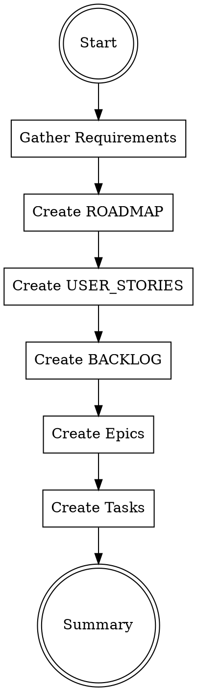

# Project Planning

## Overview

Orchestrate the creation of complete planning hierarchy from business requirements.

**Announce at start:** "I'm using the project-planning skill to generate the planning hierarchy."

## Documents Generated

| Document | Skill Used | Purpose |
|----------|------------|---------|
| `ROADMAP.md` | roadmap-planning | Milestones and timeline |
| `USER_STORIES.md` | story-planning | User needs and stories |
| `BACKLOG.md` | (generated) | Prioritized feature list |
| `epics/E*/INDEX.md` | epic-planning | Epic overview and tasks |
| `epics/E*/00-todo/TASK_*.md` | task-planning | Task skeletons |

## The Process



## Phase 1: Gather Requirements

From previous documentation:
- MVP_DEFINITION.md (features)
- TARGET_PERSONAS.md (users)
- PROJECT_CHARTER.md (timeline, objectives)
- PRODUCT_VISION.md (goals)

If not available, ask user for:
- Key features (5-10)
- Timeline constraints
- Priority features for first release

## Phase 2: Create ROADMAP

**REQUIRED SUB-SKILL:** Use `orbty-eazy:roadmap-planning`

Input:
- Project timeline
- Major milestones
- Feature priorities

Output: `docs/planning/ROADMAP.md`

## Phase 3: Create USER_STORIES

**REQUIRED SUB-SKILL:** Use `orbty-eazy:story-planning`

Input:
- Target personas
- MVP features
- User goals

Output: `docs/planning/USER_STORIES.md`

## Phase 4: Create BACKLOG

Generate prioritized backlog from user stories:

```markdown
# Backlog: {Project Name}

## Priority Levels
- **P0**: Must have for MVP
- **P1**: Should have
- **P2**: Nice to have
- **P3**: Future consideration

## Backlog Items

| ID | Feature | Priority | Epic | Status |
|----|---------|----------|------|--------|
| F01 | {Feature} | P0 | E01 | Planned |
| F02 | {Feature} | P0 | E01 | Planned |
| F03 | {Feature} | P1 | E02 | Planned |

---
_Last Updated: {YYYY-MM-DD}_
```

Output: `docs/planning/BACKLOG.md`

## Phase 5: Create Epics

**REQUIRED SUB-SKILL:** Use `orbty-eazy:epic-planning`

For each logical grouping of features:
- Create epic with INDEX.md
- Create folder structure (00-todo, 01-doing, 02-done)
- Map user stories to tasks

Output: `docs/planning/epics/E{NN}-{name}/INDEX.md`

## Phase 6: Create Tasks

**REQUIRED SUB-SKILL:** Use `orbty-eazy:task-planning`

For each epic, create task skeletons:
- One TASK.md per discrete work item
- Include metadata, objective, acceptance criteria
- Leave Implementation Steps empty (added by writing-plans)

Output: `docs/planning/epics/E{NN}-{name}/00-todo/TASK_*.md`

## Folder Structure Created

```
docs/planning/
├── ROADMAP.md
├── USER_STORIES.md
├── BACKLOG.md
└── epics/
    ├── E01-foundation/
    │   ├── INDEX.md
    │   ├── 00-todo/
    │   │   ├── TASK_E01-TK01_setup.md
    │   │   └── TASK_E01-TK02_config.md
    │   ├── 01-doing/
    │   └── 02-done/
    └── E02-feature/
        ├── INDEX.md
        ├── 00-todo/
        ├── 01-doing/
        └── 02-done/
```

## Summary Output

After completion:

```markdown
## Planning Complete

### Documents Created
- ROADMAP.md (3 milestones)
- USER_STORIES.md (12 stories)
- BACKLOG.md (15 features)
- 2 Epics with 8 tasks

### Epic Overview
| Epic | Tasks | Priority |
|------|-------|----------|
| E01-foundation | 5 | P0 |
| E02-feature | 3 | P1 |

### Next Steps
1. Review and refine generated documents
2. Pick a task from E01/00-todo/
3. Use `orbty-eazy:writing-plans` to enrich with TDD steps
4. Use `orbty-eazy:executing-plans` to implement
```

## Remember

- Trace every task to a user story
- Keep first epic focused on foundation
- Prioritize ruthlessly (P0 is MVP only)
- Create realistic, achievable tasks
- Each task should be completable in 2-8 hours
