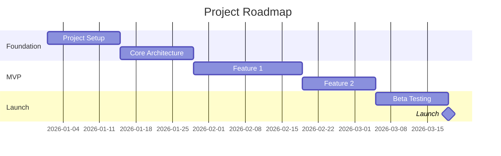
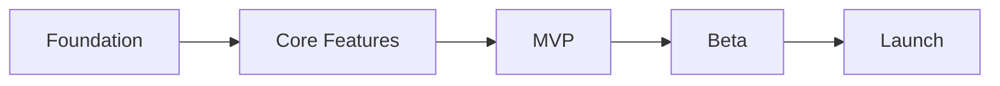

# Roadmap Planning

## Overview

Generate project roadmap with milestones, timeline, and high-level feature planning.

**Announce at start:** "I'm using the roadmap-planning skill to generate the roadmap."

## Output

`docs/planning/ROADMAP.md`

## Input Required

- Project timeline (from PROJECT_CHARTER)
- Major milestones
- Feature priorities (from MVP_DEFINITION)
- Dependencies and constraints

## ROADMAP.md Template

```markdown
# Roadmap: {Project Name}

## Overview
{1-2 sentence roadmap summary}

## Timeline



## Milestones

### M1: Foundation ({Target Date})
**Goal**: Project infrastructure ready

**Deliverables**:
- [ ] Repository setup and CI/CD
- [ ] Development environment
- [ ] Core architecture in place
- [ ] Database schema

**Success Criteria**:
- All developers can build locally
- CI pipeline passing
- Basic deployment working

---

### M2: Core Features ({Target Date})
**Goal**: Primary functionality complete

**Deliverables**:
- [ ] {Feature 1}
- [ ] {Feature 2}
- [ ] {Feature 3}

**Success Criteria**:
- Core user flows working
- Tests passing
- Performance acceptable

---

### M3: MVP ({Target Date})
**Goal**: Minimum viable product ready

**Deliverables**:
- [ ] All P0 features complete
- [ ] User authentication
- [ ] Core functionality end-to-end

**Success Criteria**:
- All acceptance criteria met
- Ready for beta users
- Documentation complete

---

### M4: Beta ({Target Date})
**Goal**: Beta testing complete

**Deliverables**:
- [ ] Beta user feedback collected
- [ ] Critical bugs fixed
- [ ] Performance optimized

**Success Criteria**:
- {N} beta users onboarded
- NPS > {score}
- No critical issues

---

### M5: Launch ({Target Date})
**Goal**: Production launch

**Deliverables**:
- [ ] Production deployment
- [ ] Monitoring in place
- [ ] Support processes ready

**Success Criteria**:
- System stable
- Users can sign up
- Business metrics tracking

---

## Feature Phases

### Phase 1: Foundation
| Feature | Priority | Status |
|---------|----------|--------|
| {Feature} | P0 | Planned |

### Phase 2: Core
| Feature | Priority | Status |
|---------|----------|--------|
| {Feature} | P0 | Planned |

### Phase 3: Enhancement
| Feature | Priority | Status |
|---------|----------|--------|
| {Feature} | P1 | Planned |

### Future (Backlog)
| Feature | Priority | Notes |
|---------|----------|-------|
| {Feature} | P2 | Post-launch |

## Dependencies



## Risks & Mitigation

| Risk | Impact | Mitigation |
|------|--------|------------|
| {Risk} | High | {Strategy} |

## Key Dates

| Date | Event |
|------|-------|
| {Date} | Development Start |
| {Date} | MVP Complete |
| {Date} | Beta Start |
| {Date} | Launch |

---
_Created: {YYYY-MM-DD}_
_Last Updated: {YYYY-MM-DD}_
```

## Remember

- Align with PROJECT_CHARTER timeline
- Be realistic about estimates
- Include buffer for unknowns
- Mark critical path clearly
- Use mermaid for visualizations
