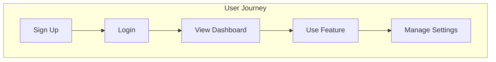

# Story Planning

## Overview

Generate user stories that capture user needs and map them to features.

**Announce at start:** "I'm using the story-planning skill to generate user stories."

## Output

`docs/planning/USER_STORIES.md`

## Input Required

- TARGET_PERSONAS.md (users)
- MVP_DEFINITION.md (features)
- PRODUCT_VISION.md (goals)

## USER_STORIES.md Template

```markdown
# User Stories: {Project Name}

## Overview
User stories organized by persona and feature area.

## Story Format
```
As a {persona},
I want {goal/action},
So that {benefit/value}.
```

---

## Persona: {Primary Persona Name}

### Authentication

#### US001: User Registration
> As a {persona},
> I want to create an account with my email,
> So that I can access the platform securely.

**Acceptance Criteria**:
- [ ] User can enter email and password
- [ ] Email validation enforced
- [ ] Password strength requirements shown
- [ ] Confirmation email sent
- [ ] User redirected to dashboard after verification

**Priority**: P0
**Epic**: E01-foundation

---

#### US002: User Login
> As a {persona},
> I want to log in with my credentials,
> So that I can access my account.

**Acceptance Criteria**:
- [ ] User can enter email and password
- [ ] Invalid credentials show error
- [ ] Successful login redirects to dashboard
- [ ] Session persists across browser refresh

**Priority**: P0
**Epic**: E01-foundation

---

### Core Feature: {Feature Area}

#### US003: {Story Title}
> As a {persona},
> I want {action},
> So that {benefit}.

**Acceptance Criteria**:
- [ ] {Criterion 1}
- [ ] {Criterion 2}
- [ ] {Criterion 3}

**Priority**: P0
**Epic**: E02-{feature}

---

#### US004: {Story Title}
> As a {persona},
> I want {action},
> So that {benefit}.

**Acceptance Criteria**:
- [ ] {Criterion 1}
- [ ] {Criterion 2}

**Priority**: P1
**Epic**: E02-{feature}

---

## Persona: {Secondary Persona Name}

### {Feature Area}

#### US010: {Story Title}
> As a {persona},
> I want {action},
> So that {benefit}.

**Acceptance Criteria**:
- [ ] {Criterion}

**Priority**: P1
**Epic**: E03-{feature}

---

## Story Map



## Story Summary

| ID | Title | Persona | Priority | Epic |
|----|-------|---------|----------|------|
| US001 | User Registration | {Persona} | P0 | E01 |
| US002 | User Login | {Persona} | P0 | E01 |
| US003 | {Title} | {Persona} | P0 | E02 |

## Story by Priority

### P0 - Must Have (MVP)
- US001: User Registration
- US002: User Login
- US003: {Core Feature}

### P1 - Should Have
- US004: {Feature}

### P2 - Nice to Have
- US010: {Feature}

---
_Created: {YYYY-MM-DD}_
_Last Updated: {YYYY-MM-DD}_
```

## Writing Good User Stories

### INVEST Criteria

| Criterion | Description |
|-----------|-------------|
| **I**ndependent | Can be developed standalone |
| **N**egotiable | Details can be discussed |
| **V**aluable | Delivers user value |
| **E**stimable | Can estimate effort |
| **S**mall | Fits in one sprint |
| **T**estable | Has clear acceptance criteria |

### Good vs Bad Stories

| Bad | Good |
|-----|------|
| "User can login" | "As a user, I want to login with email/password so that I can access my account" |
| "Add search" | "As a user, I want to search by keyword so that I can quickly find relevant content" |
| "Make it faster" | "As a user, I want pages to load in under 2 seconds so that I can work efficiently" |

## Remember

- One story = one user goal
- Acceptance criteria are testable
- Link every story to a persona
- Map stories to epics
- Prioritize ruthlessly
